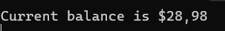
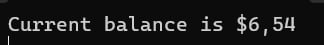
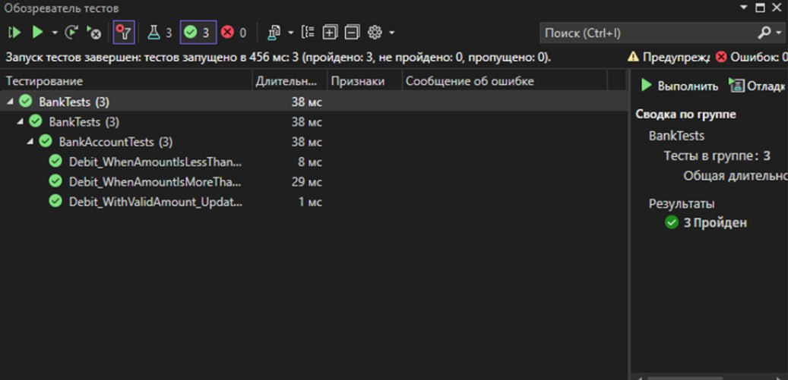

# Bank-master

В ходе работы был создан проект Bank, содержащий класс BankAccount с методами Debit и Credit. Эти методы были протестированы с использованием модульных тестов в проекте BankTests. 

Debit_WithValidAmount_UpdatesBalance — проверка корректности списания средств при допустимой сумме.
Debit_WhenAmountIsLessThanZero_ShouldThrowArgumentOutOfRange — проверка выброса исключения при попытке списания отрицательной суммы.
Debit_WhenAmountIsMoreThanBalance_ShouldThrowArgumentOutOfRange — проверка выброса исключения при попытке списания суммы, превышающей баланс.

Тесты были успешно пройдены после исправления ошибки в методе Debit, где вместо вычитания суммы происходило ее добавление.
Рефакторинг кода и добавление корректных проверок на выброс исключений улучшили качество кода.

Изначально тест Debit_WithValidAmount_UpdatesBalance не был пройден из-за ошибки в коде метода Debit. После исправления ошибки тест был успешно пройден.
